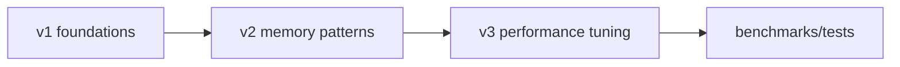

# core-legacy-systems

Hands-on systems progression repository focused on allocator design, memory safety patterns, and performance tuning.

## Why This Exists

This repo demonstrates systems fundamentals through staged evolution rather than artificial commit history.

## Architecture



## Project Layout

- `v1_foundations_cpp/` baseline structures
- `v2_memory_patterns/` ownership + allocation patterns
- `v3_performance_tuning/` optimization experiments
- `src/allocators/` allocator primitives
- `tests/` native test binaries
- `docs/` architecture + ADRs

## Usage

```bash
make test
```

## Roadmap

- Add pool allocator and fragmentation metrics
- Add benchmark harness for allocator comparisons
- Add cache-locality experiments
