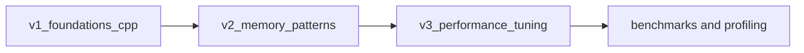

# Architecture

This repository is split into conceptual eras so reviewers can inspect systems progression without date spoofing.

## Module Boundaries

- `v1_foundations_cpp`: fixed-size structures and deterministic behavior.
- `src/allocators`: explicit memory-region ownership and allocation policy.
- `v3_performance_tuning`: micro-benchmark harnesses and cache-level observations.

## Review Lens

- Correctness under constrained memory.
- Predictable allocation paths.
- Measurable performance deltas after refactors.
